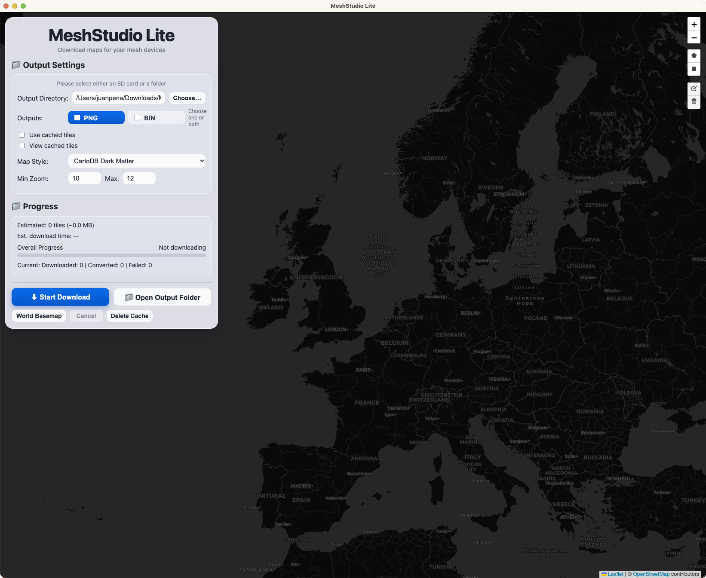

# MeshStudio Lite

MeshStudio Lite is a local-first map tile downloader for mesh devices. It supports direct tile export while downloading, with optional 8-bit PNG and LVGL RGB565 BIN output.

## Screenshot



## Features

- Local desktop app by default (Qt), with optional browser mode.
- Draw polygons on-map and download selected zoom ranges.
- World basemap download mode (zoom 0-7).
- Output folder export during download (no zip wait).
- Optional 8-bit PNG conversion.
- Optional RGB565 `.bin` export for LVGL (`rgb565/z/x/y.bin`).
- Cache view/delete controls.
- Live progress with estimated tiles, size, ETA, and counters.

## Installation

1. Clone:

```bash
git clone https://github.com/mattdrum/map-tile-downloader.git
cd map-tile-downloader
```

2. Install Python dependencies:

```bash
pip install -r requirements.txt
```

## One-Click Launchers

MeshStudio Lite includes double-click launchers that install requirements and then start the app.

- macOS: `Launch_MeshStudio_Lite.command`
- Windows: `Launch_MeshStudio_Lite.bat`

What they do:

1. `cd` to the project folder.
2. Run `pip install -r requirements.txt`.
3. Launch `src/TileDL.py`.

### macOS notes

- If macOS blocks the launcher on first run, right-click `Launch_MeshStudio_Lite.command` and choose **Open**.
- You can also run:

```bash
chmod +x Launch_MeshStudio_Lite.command
```

## Manual Launch

### Desktop mode (default)

```bash
python src/TileDL.py
```

### Browser mode

```bash
python src/TileDL.py --browser
```

Then open [http://127.0.0.1:5000](http://127.0.0.1:5000).

## Basic Workflow

1. Pick map style.
2. Set output directory.
3. Choose output format(s): `PNG`, `BIN`, or both.
4. Draw polygons or use world basemap mode.
5. Start download.

## Notes

- Map sources are configured in `config/map_sources.json`.
- App/window branding is `MeshStudio Lite`.

## License

MIT
